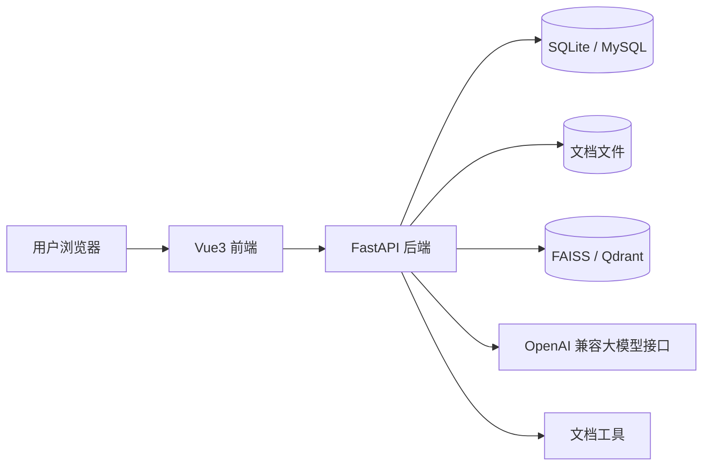
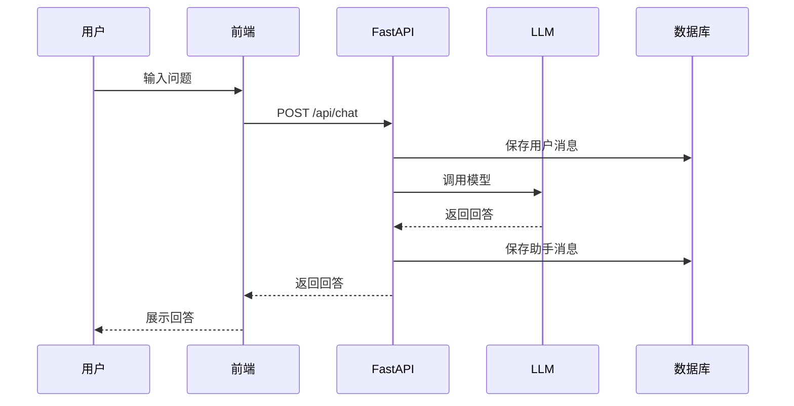
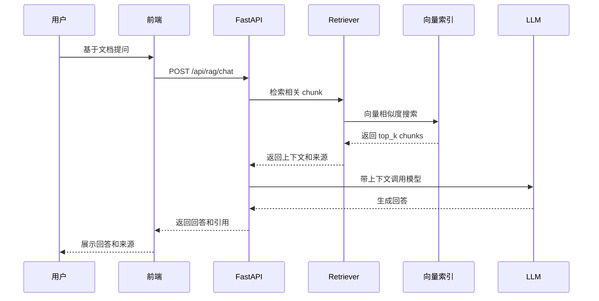

# 系统架构

## 1. 总体架构



---

## 2. 核心模块

### 2.1 前端

职责：

- 聊天界面。
- 文档上传。
- 文档列表。
- 会话切换。
- Markdown 渲染。
- 引用来源展示。
- 工具入口。

---

### 2.2 后端 API

职责：

- 接收前端请求。
- 参数校验。
- 调用业务服务。
- 返回普通响应或流式响应。
- 统一错误处理。
- 日志记录。

---

### 2.3 LLM 服务层

职责：

- 封装 OpenAI 兼容接口。
- 管理 `base_url`、`api_key`、`model`。
- 支持普通输出。
- 支持流式输出。
- 支持结构化输出。
- 支持工具调用。
- 处理超时和重试。

原则：

业务代码不能直接散落模型调用逻辑，必须经过统一的 LLM Client。

---

### 2.4 RAG 模块

职责：

- 文档解析。
- 文本清洗。
- 文本切片。
- Embedding 生成。
- 向量索引构建。
- 相似度检索。
- Prompt 拼接。
- 引用来源返回。

---

### 2.5 工具模块

第一阶段工具：

- 总结文档。
- 提取待办。
- 生成周报。

工具设计要求：

- 输入参数结构化。
- 输出结果结构化。
- 失败原因可记录。
- 调用过程可追踪。

---

## 3. 聊天请求流程



---

## 4. RAG 问答流程



---

## 5. 文档入库流程

```text
上传文件
  -> 文件类型识别
  -> 文本解析
  -> 文本清洗
  -> 文本切片
  -> 生成 Embedding
  -> 写入向量索引
  -> 保存文档和 chunk 元数据
```

---

## 6. 关键设计原则

1. 先完成闭环，再优化细节。
2. LLM 调用、RAG、工具调用必须模块化。
3. 所有 Prompt 要可维护，不要硬编码在接口函数里。
4. RAG 回答必须返回来源。
5. 线上部署必须通过环境变量配置敏感信息。
6. 每个阶段都能打 tag，方便面试展示演进过程。

